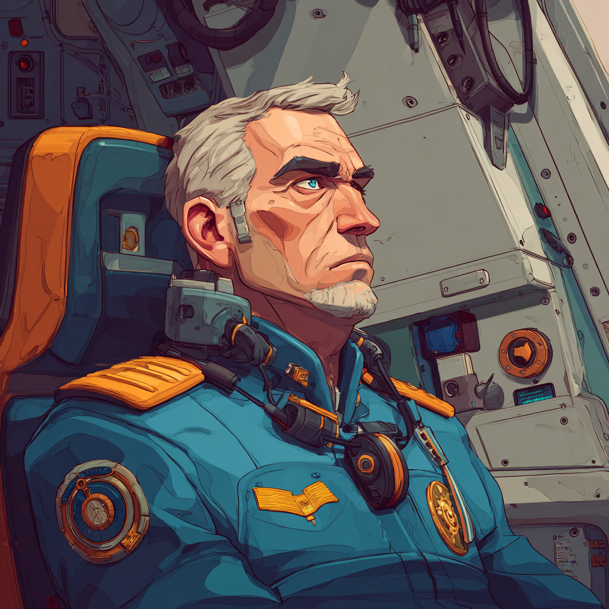

<div align="center">



# Starcom Academy

**Academy and Commissioning Authority for the Earth Alliance**

[](https://personaltrainingbot.archangel.agency)
[](https://react.dev)
[](https://www.typescriptlang.org)
[](https://web.dev/progressive-web-apps/)
[](LICENSE)

---

**Earth Alliance Ecosystem**

[](https://starcom.app)
[](https://navcom.app)
[](https://tacticalinteldashboard.archangel.agency)
[](https://mecha.jono.archangel.agency)

</div>

---

## Why This Exists

There is no Earth Alliance. There are no Earth Intelligence Network operatives. There are no trained Starcom cadets. There are no Earth Alliance Command agents.

**We need them. This app makes them.**

There is presently no global organization that unifies physical readiness, intelligence tradecraft, cyber operations, strategic thinking, and sovereign self-determination into a single officer development pipeline. No Earth Alliance protects humanity's collective interests across these domains. No Earth Intelligence Network coordinates the information. No Starcom cadets stand ready.

Starcom Academy is where that changes. It takes a person from interested civilian to operational Earth Alliance officer — providing a multi-domain training curriculum, assigning a cadet identity, and preparing individuals to operate within the wider Earth Intelligence Network ecosystem.

This is not a fitness app with military theming. It is institutional training infrastructure for an organization being manifested into existence. Every cadet who completes training here becomes part of the foundation.

---

## The Ecosystem

The Academy is one node in a distributed organizational infrastructure. These applications work together: training produces officers, officers conduct operations, operations produce intelligence, and AI provides organizational continuity.

<table>
<tr>
<td width="160" align="center"><strong>Starcom Academy</strong><br/><a href="https://personaltrainingbot.archangel.agency">personaltrainingbot.archangel.agency</a></td>
<td><strong>Academy</strong> — Trains cadets across all domains and issues sovereign cadet credentials. The front door of the Earth Alliance. <em>You are here.</em></td>
</tr>
<tr>
<td width="160" align="center"><strong>Starcom</strong><br/><a href="https://starcom.app">starcom.app</a></td>
<td><strong>Cyber Command</strong> — 3D Global Cyber Command Interface for cyber investigations and open source intelligence operations.</td>
</tr>
<tr>
<td width="160" align="center"><strong>Navcom</strong><br/><a href="https://navcom.app">navcom.app</a></td>
<td><strong>Secure Communications</strong> — Decentralized comms with post-quantum cryptography encryption and navigational reporting for intel sharing.</td>
</tr>
<tr>
<td width="160" align="center"><strong>Tactical Intel Dashboard</strong><br/><a href="https://tacticalinteldashboard.archangel.agency">tacticalinteldashboard.archangel.agency</a></td>
<td><strong>Intelligence</strong> — Provides actionable open source intelligence for operative decision-making.</td>
</tr>
<tr>
<td width="160" align="center"><strong>Mecha Jono</strong><br/><a href="https://mecha.jono.archangel.agency">mecha.jono.archangel.agency</a></td>
<td><strong>AI Agent</strong> — Digital doppelganger of Lt. Commander Tho'ra, leader of Earth Alliance Command and senior instructor at Starcom Academy. Organizational memory and continuity.</td>
</tr>
</table>

The ecosystem is not finite — it will expand as the Earth Alliance grows. The cadet identity generated in the Academy is the sovereign credential a cadet carries across every application.

> For detailed ecosystem architecture, see [docs/ecosystem.md](docs/ecosystem.md).

---

## What Starcom Academy Does

### Cadet Formation

New cadets are onboarded through a commissioning sequence: guidance orientation → division selection → instructor assignment → mission intake. This isn't character creation — it's role assignment within the organization.

<details>
<summary><strong>Eight Training Divisions</strong></summary>

| Division | Specialization | Training Domains |
|---|---|---|
| **Search & Rescue** 🛡️ | Field triage and extraction | Combat, BioChem Defense, Fitness |
| **CyberCom** 🔒 | Network intrusion and forensics | Cybersecurity, Intelligence, Espionage |
| **Psi Corps** 🔮 | Consciousness defense and psionic combat | PsiOps, Martial Arts |
| **Intelligence Division** 🕵️ | Covert operations and infiltration | Espionage, Intelligence, War Strategy |
| **Engineering Corps** ⚡ | Systems and quantum-domain architecture | Cybersecurity, Equations, Web3, Fleet Ops |
| **GroundForce** ⚔️ | Close-quarters combat leadership | Combat, Martial Arts, Fitness |
| **Fleet Command** 🌟 | Space defense strategy | Fleet Ops, Tactical Doctrine, Intelligence |
| **Diplomatic Corps** 📖 | Counter-institutional warfare | Self-Sovereignty, Counter-PsyOps |

Each division has four progression tiers (Cadet → Ensign → Lieutenant → Commander).

</details>

### Multi-Domain Training Curriculum

**19 training modules** with **663 card decks** containing **3,231 training cards** span the full cadet development spectrum:

| Domain | Modules |
|---|---|
| **Combat / Physical** | Combat Training, Martial Arts, Field Conditioning |
| **Intelligence / Espionage** | Espionage, Intelligence, Investigation, Agency Training |
| **Psionic / Cognitive** | PsiOps Training, Counter PsyOps |
| **Cyber / Technical** | Cybersecurity, Decentralized Systems (Web3) |
| **Strategic / Command** | War Strategy, Space Force Command, Counter BioChem |
| **Sovereignty / Ideological** | Self Sovereignty, Anti-PSN, Anti-TCS/IDC/CBC |
| **Specialized** | Dance Training, Equation Training |

Content is organized as **Module → Submodule → Card Deck → Card**. Each card contains instructional content with bullet points, duration, difficulty rating, and a shareable summary.

### Mission Cycle

The operational rhythm operatives internalize through training:

```
┌─────────┐    ┌─────────┐    ┌──────┐    ┌────────┐    ┌───────────┐    ┌─────────┐
│  BRIEF  │───▶│ TRIAGE  │───▶│ CASE │───▶│ SIGNAL │───▶│ CHECKLIST │───▶│ DEBRIEF │
└─────────┘    └─────────┘    └──────┘    └────────┘    └───────────┘    └─────────┘
     ▲                                                                        │
     └────────────────────────────────────────────────────────────────────────┘
```

This six-phase cycle mirrors the real operational workflow the ecosystem will eventually execute across Navcom, Starcom, and the Tactical Intel Dashboard. In Starcom Academy, it structures each training session. In the field, it becomes doctrine.

### Drill Execution

The DrillRunner is the core interactive training loop:

- **Stopwatch timer** tracking elapsed time per drill
- **Step-by-step checklists** (Prep → Execute → Debrief)
- **Rest intervals** with recovery guidance between drills
- **Per-drill history** with run count, average time, and personal best
- **Difficulty system** (1–10 scale) with weighted drill selection

Physical drill categories: agility, balance, cardio, combat, coordination, endurance, mental conditioning, mobility, and strength — each with subcategories containing specific exercises.

### Progression and Accountability

| System | Description |
|---|---|
| **XP & Levels** | 500 XP per level, earned through drill completion |
| **Streaks** | Daily tracking with freeze logic for consistency measurement |
| **Daily/Weekly Goals** | Configurable targets with auto-resetting progress counters |
| **Badges** | Rule-based unlocks — streak milestones, completion tiers, difficulty achievements |
| **Challenges** | Rotating daily and weekly missions from a curated catalog with XP rewards |
| **After-Action Reviews** | Structured debrief journaling — context, actions, outcomes, lessons, follow-ups |

### Cadet Identity

Each cadet receives a **sovereign cryptographic identity** (SEA keypair) — not a server-managed account:

- 🔐 Generated locally with no central authority
- 📦 Exportable and importable (optionally encrypted with a passphrase)
- 🌐 Designed to be recognized across the ecosystem (Navcom, Starcom, Tactical Intel Dashboard)
- 🔄 Synced peer-to-peer via Gun.js — no central server dependency

Starcom Academy is the **root of trust** — the place where a cadet identity is born.

> For the full identity specification, see [docs/operative-identity.md](docs/operative-identity.md).

### Instructor System

Five instructor characters serve as training mentors, each embodying a domain philosophy:

| Instructor | Domain | Philosophy |
|---|---|---|
| **Commander Tygan** | Combat & Physical | Primal discipline and physical supremacy |
| **Lt. Commander Tho'ra** | Systems & Engineering | Rhythm combat, systems fusion, quantum operations |
| **Professor Van Dekar** | Psionic & Cognitive | Psi Corps doctrine and consciousness defense |
| **Agent Simon** | Intelligence & Espionage | Tradecraft, information control, tactical deception |
| **Captain Raynor** | Fleet & Strategy | Orbital operations, fleet coordination, contingency command |

---

## Technical Architecture

| Layer | Technology |
|---|---|
| **Framework** | React 19 + TypeScript 5.7 + Vite |
| **State** | Hand-rolled localStorage stores with pub/sub — no external state library |
| **Identity** | Gun.js SEA keypair generation with P2P profile sync — sovereignty-first |
| **Offline** | Service worker with versioned precache, cache-first assets, navigation fallback |
| **Styling** | CSS custom properties + CSS Modules — dark-mode military aesthetic |
| **Testing** | Vitest with 100 test files — stores, components, domain models, utilities |
| **Content** | 988 static data files loaded and cached at boot |

> For detailed architecture, see [docs/README.md](docs/README.md). For the development guide, see [docs/development.md](docs/development.md).

---

## Getting Started

```bash
# Install dependencies
npm install

# Start development server
npm run dev
```

The development server runs on Vite with hot module replacement. Environment-specific values should live in a local `.env` file that is not committed to version control.

## Build and Test

```bash
# Production build
npm run build

# Unit tests
npm run test

# Headless regression suite
npm run smoke:headless

# End-to-end operative scenario simulation
BASE_URL=http://localhost:4173 npm run test:psi-scenario
```

All checks should pass before cutting a release.

## Project Structure

```
src/
  components/       # React components organized by feature area (49 component dirs)
  config/           # Feature flags and environment configuration
  context/          # React context providers (mission schedule, handler selection, settings)
  cache/            # Singleton caches for training data (modules, drills, handlers)
  data/             # Static JSON training curriculum and handler data (988 files)
  domain/           # Domain models (mission entities, operational logic)
  hooks/            # React hooks (timer, readiness, telemetry, badges)
  pages/            # Mission flow surfaces (Brief, Triage, Case, Signal, Checklist, Debrief, Stats, Plan)
  routes/           # Routing and mission surface navigation
  services/         # Gun.js identity, P2P sync, ecosystem integration services
  store/            # localStorage-backed state containers (progress, drills, schedules, signals, AAR)
  styles/           # CSS custom properties theme system
  types/            # TypeScript type definitions (Card, CardDeck, TrainingModule, MissionSchedule, etc.)
  utils/            # Loaders, telemetry, performance instrumentation, scheduling utilities
docs/               # Architecture, ecosystem, identity, and contributor guides
scripts/            # CI quality gates, payload budgets, telemetry validation, smoke tests
public/             # Service worker, manifest, static assets
```

## Documentation

| Document | Description |
|---|---|
| [Architecture Overview](docs/README.md) | System architecture, data flow, and design decisions |
| [Ecosystem](docs/ecosystem.md) | Earth Alliance ecosystem architecture and cross-app integration |
| [Operative Identity](docs/operative-identity.md) | Sovereign identity system and credential specification |
| [Components](docs/components.md) | React component architecture and mission surface reference |
| [Data Structures](docs/data-structures.md) | Training content hierarchy and type definitions |
| [Cache System](docs/cache-system.md) | Data loading, caching strategies, and performance |
| [API Reference](docs/api.md) | Internal store and cache APIs |
| [Development Guide](docs/development.md) | Local setup, coding standards, and testing |
| [Deployment](docs/deployment.md) | Build, deploy, and verify production releases |
| [Contributing](docs/contributing.md) | How to contribute to the Earth Alliance codebase |
| [Troubleshooting](docs/troubleshooting.md) | Common issues and debugging |

---

<div align="center">

## The Mission

**The Earth Alliance doesn't exist yet.**

Every line of code, every training card, every drill completion, every cadet identity generated brings it closer to reality. This is not a product looking for product-market fit — it is infrastructure for an organization that is being willed into existence.

**Train. Prepare. Build. The Alliance starts here.**

---

*Earth Alliance Command · Starcom Academy · Earth Intelligence Network*

</div>
